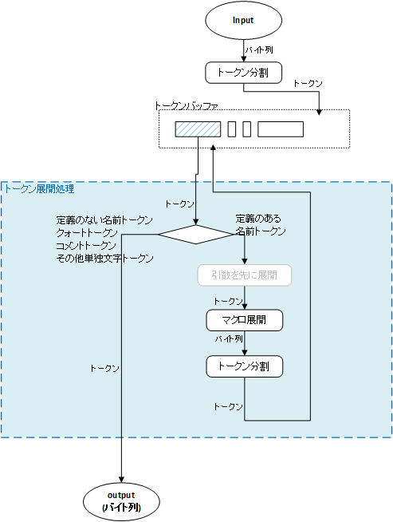
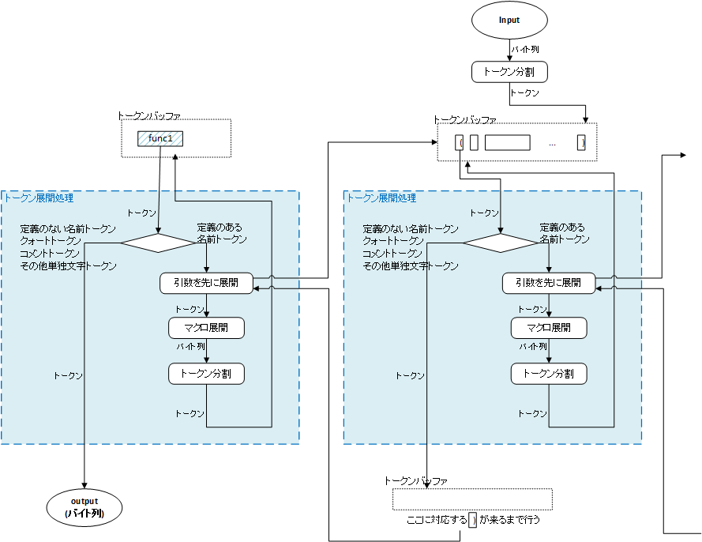

========================
m4
========================

参考ドキュメント
=======================

- `Super Technique 講座～m4 チュートリアル <http://www.nurs.or.jp/~sug/soft/super/m4.htm>`__
- 本家: `GNU M4 - GNU macro processor - GNU Project - Free Software Foundation <https://www.gnu.org/software/m4/manual/>`__
- 翻訳(少し古い): `GNU macro processor <https://www.hariguchi.org/info/ja/m4-1.4/m4-ja.html>`__
- 翻訳(少し古い): `GNU m4, version 1.4: GNU m4 <https://web.sfc.wide.ad.jp/~sagawa/gnujdoc/m4-1.4/>`__


Cheatsheet
======================

TODO


特徴
======================

- マクロプロセッサ

  - C言語のプリプロセッサに近い
  - テンプレートエンジンのmastashみたいなものにも近いかも
  - ``sed 's/foo/bar/g' input > output`` みたいなのにも近いかも
  - 基本は置換置換を繰り返し処理していく

    - cf. C言語とかPerlとかJavaとかは、値の代入と何らかの副作用(printとか)が中心だと考えている。
    - 関数型言語と近いところがある気もする

- 何もなければ、入力がそのまま出力される
- マクロに該当するところは置換される
- さらにそれは入力に戻されて繰り返し解釈できなくなるまで置換され、その後出力される。

::

    changequote({,})dnl
    define({bar}, {world})dnl
    define({foo}, {bar})dnl
    Hello foo!
    
      ↓

    Hello world!


処理の流れ
======================

- m4の基本は置換。
- 入力を読んでいきトークンを認識する
- トークンに該当するマクロがある場合、その結果で置換する
- 置換結果は、入力にプッシュバックされ、再度トークン認識から行われる


入力のトークンへの分割
-------------------------

m4 は入力を読み込むと、それを以下の種類のトークンに分割する。

- 名前トークン(name)

  - アルファベット、数字、 ``_`` (アンダースコア) を自由に並べたもののうち、先頭の文字が数字でないもの
  - 名前にマクロの定義が存在するときは、マクロの呼び出しとして認識され、 展開の対象となる
  - ``foo``, ``_tmp``, ``name01``

- クオートトークン(quoted string)

  - クォートされた文字列（quoted string）は、 (デフォルトでは)引用符 ````` と ``'`` に
    囲まれた文字列のうち、 
    文字列の内部で開始引用符 ````` と終了引用符 ``'`` の数が釣り合っているものです。 
  - クォートトークンとしての値は、 
    いちばん外側にある引用符を一対だけ取った文字列::

        `'           → 空文字列
        `hoge'       → hoge
        ``hoge''     → `hoge'

  - クォートされた文字列は、マクロ展開されない
  - クォート記号を変えるには、changequote(開始クォート文字列,終了クォート文字列)

- コメントトークン(comment)

  - ``#`` から改行までの間
  - 他の言語とことなりコメントは無視されるわけではない (lenの中とかにいれるときちんと長さを返す)
  - コメントはマクロ展開されない
  - コメントのトークンとしての値は、そのままの値(#～改行)。

    - 出力もしてほしくない場合は、dnl を使う
    - また、ifelse(comment) が、dnlを何度も使わずに(出力もされない)ブロックコメントを挿入するために良く使われるイディオム

  - コメントは入れ子にすることはできない。
  - コメント記号を変えるには、changecom(開始コメント文字列,終了コメント文字列)

- その他単独文字トークン(other)

  - 名前トークン、クォートトークン、コメントトークンの構成要素にならない文字はすべて、
    それ自身で一つのトークンとなります。(1文字トークン)
  - 記号、空白、改行など
  - マクロ展開されない(名前じゃないからね)
  - その他単独文字トークンの値は、そのままの1文字


トークン処理の流れ
----------------------

分かりやすく説明するために、実装とは少し異なる。
(実装では、無駄な記憶領域を作らないために、トークンバッファを作らず、入力を頭から1つ1つ処理したり、入力・出力をスタックにしたりしている。)


引数を伴わないマクロのみの場合
^^^^^^^^^^^^^^^^^^^^^^^^^^^^^^^^^^

引数を伴うマクロの処理は、少し複雑になるので、後述。
まずは、引数を伴わないマクロのみの場合で説明する。(※)



- 入力(バイト列)は、順次トークンに分割され、トークンバッファに追加される
- トークンバッファの先頭のトークンに対し、トークン展開処理(expand_token)を行う

  - 定義のない名前トークン、クォートトークン、コメントトークン、その他単独文字トークンの場合

    - トークンをそのまま出力側に流す

  - 定義のある名前トークンの場合(expand_macro) (※引数を伴わないものに限定)

    - マクロ定義テーブルから、名前に対応する定義を引っ張ってきて処理(call_macro)

      - ビルトインマクロの場合は、C言語で書かれた関数が呼ばれ、結果のバイト列が返る
      - ユーザ定義マクロの場合は、バイト列が返る

    - バイト列をトークン分割
    - 結果のトークン列を、トークンバッファの先頭の処理したトークンと差し替える (push_back)


引数を伴うマクロの場合
^^^^^^^^^^^^^^^^^^^^^^^^^^^^^^^^^^

引数を伴うマクロの場合、つまり、名前トークンの直後が ``(`` トークンだった場合、
引数を集める処理(collect_arguments)を行う。

以下の2段階

#. 対応する ``)`` が来るまで、引数部分を先に展開する
#. ``(`` から ``)`` までのトークン列を引数に整理する


対応する ``)`` が来るまで、引数部分を先に展開する処理
~~~~~~~~~~~~~~~~~~~~~~~~~~~~~~~~~~~~~~~~~~~~~~~~~~~~~~~~




- 一段上に、入力用トークンバッファ/出力用トークンバッファを新たに確保し、
  そこで ``)`` が出力に現れるまで、同様に expand_token 処理を行う

  - その過程で、また引数を伴う名前トークンが来た場合は、さらに一段上に用意して処理を行う(再帰的に)

  
``(`` から ``)`` までのトークン列を引数に整理する
~~~~~~~~~~~~~~~~~~~~~~~~~~~~~~~~~~~~~~~~~~~~~~~~~~~~~~~~

- 一番外側の単独文字トークン ``(`` ``)`` は除く
- クオート中でもなく、コメント中でもなく、単独文字トークン ``(``, ``)`` で囲まれてもいない、 ``,`` トークンで分割
- 各引数の先頭にある連続した空白系のトークンは除く
- 各引数をトークン列からバイト列にする


引数置換文字の処理
~~~~~~~~~~~~~~~~~~~~~~~~~~~~~~~~~~~~~~~~~~~~~~~~~~~~~~~~

マクロ定義中の `$0`, `$1`, ..., `$#`, `$@`, `$*` は、各引数で置換される。

これは単なるバイト列の置換。クォートの中にこれらがあっても置換はされる。


文法
=================


マクロ呼出し

::

    name     # 引数を伴わないマクロ呼び出し。 × name() --- 空文字列1つを持つマクロ呼び出しになる

    name(arg1, arg2, ..., argn)     # 引数を伴うマクロ呼び出し。
                                    #   nameと `(` の間には空白を入れてはいけない
                                    #   各引数の前にあるクオートされていない空白は除去される

    `name`   # マクロを呼び出したくない場合 → クオートする

    indir(`X')Free86  # 名前の切れ目じゃないところでマクロを呼び出したい場合

多くの組み込みマクロは引数なしで呼び出しても意味がないので、 それらの名前の直後に開きカッコがないときは、組み込みマクロは呼び出されません
コマンドオプション(--prefix-builtins, または-P) を使うと、組み込みマクロを呼び出すときは、 その名前の先頭にm4_をつけなければ認識されなくなります。


マクロ定義::

    define(name [, expansion])

基本的にはクォートする。
クォートしないと、この定義自体が置換され、複数の定義ができる？

::

    define(`hoge', `fuga')     # hoge を fuga に置換する。

引数を利用::

    define(`kv', `keyは$1、valueは$2)')
    kv(apple, リンゴ)
    kv(orange, みかん)

余分な引数は無視、足りない引数は空文字列になる。

::

    $0 --- マクロ名
    $# --- 引数の個数
    $* --- 全ての引数を(クォートせずに)カンマで連結したもの
    $@ --- 全ての引数を(クォートして)カンマで連結したもの
    それ以外の $ は、単に `$`文字として扱われる


::

    undefine(name)


条件分岐

::

    ifdef(NAME,IF-CASE,ELSE-CASE)
    ifelse(比較対象Ａ,比較対象Ｂ,一致時に展開[,不一致時に展開])

    5引数以上だと
    ifelse(stringA1, stringA2, 一致時に展開,
           stringB1, stringB2, 一致時に展開,
           ... )


dnl

--prefix-builtins


置換。 

トークンが前後に空白があいて(？)出現した場合は置換される。
置換は繰り返し行われる。無限ループに注意。


::

    define(`hoge', `fuga')   # hoge を fuga に置換する
    This is a hoge.          # これは hoge トークンとみなされるっぽい。

    それ以上展開させない

        define(`hoge', ``fuga'')

    複数行

        define(`hoge', `This
        is
        a
        pen')
        aaa hoge bbb


    indir(`X')  --- 強制的に置換を行う。トークン前後に空白を置きたくない場合に。

    ```
    define(`X',`W')
    XFree86               # トークン`X'とは認識されない
    indir(`X')Free86      # トークン`X'と認識される
    ```


    undefine(`X')
    pushdef( , )
    popdef( )

    include(`ファイル名')
    sinclude(`ファイル名')


    算術
    incl(4)   # インクリメント → 5
    decr(7)   # デクリメント   → 6

    eval  --- 整数式を計算する (条件のand,orなどにも使える)
        数値
            特別な接頭辞がついていない数字 --- 10進数
            0始まり --- 8進数
            0x始まり --- 16進数
            0b始まり --- 2進数
            0r32:1amu   --- 36進数までのn進数。0-9a-z 

        演算子 (優先順位の高い順。累乗を除いたすべての演算子は左結合)
            ( )               かっこ
            + - ~ !           単項のプラス、マイナス、ビット否定、論理否定
            **                累乗
            * / %             積、商、余り
            + -               和、差
            << >>             左シフト、右シフト
            > >= < <=         関係演算子
            == !=             等価演算子
            &                 ビットごとの論理積
            ^                 ビットごとの排他的論理和
            |                 ビットごとの論理和
            &&                論理積
            ||                論理和 

        関係演算子、論理演算子は 1(trueの意), 0(falseの意) を返す


    ifelse


            

    syscmd(shell-command)  --- コマンドの実行
    esyscmd(shell-command)  --- コマンドの出力を読む
        ```
        define(`osname', `esyscmd(uname -o)')
        ```
    sysval


    コマンドライン


    Cygwin の m4 だったら、
    LC_CTYPE=ja_JP.utf-8 で、ファイルの文字コードがutf-8 であれば日本語も動いた。


デバッグ
===============

トレースを有効にする::

    traceon    # 全てのマクロでトレースを有効に
    traceoff   # 全てのマクロでトレースを無効に

    traceon(`マクロ名1', `マクロ名2', ...  )  # クォート忘れずに
    traceoff(`マクロ名1', `マクロ名2', ...  )  # クォート忘れずに


デバッグ出力の制御::

    -d<フラグ>

        (例) m4 -daecx hoge.m4

        a   マクロの呼び出しに伴う実引数を表示
        e   マクロの呼び出しが展開後に消滅しない場合、展開後のテキストを表
        c   ひとつのマクロの呼び出しにつき複数のトレース行を表示します。
            マクロが認識された時点で引数を集める前に1行表示し、
            引数を集め終った後に2行目を、
            マクロの呼び出しが完了したあとに3行目を表示します。 
        x   トレースの各出力行にマクロの呼び出し毎に異なる`識別番号(id)'を加えます。
            これは上記のcフラグを使うときに便利です。 

        t   今回起動するm4におけるマクロの呼び出しを全てトレースします。
            これを付けない場合は traceon/traceoff が必要
        q   実引数やマクロの展開後のテキストを表示するときに現在の引用符でクォート

        f   トレースの各出力行に、現在の入力ファイルの名前を表示します。
        l   トレースの各出力行に、現在の入力行番号を表示します。
        p   指定した名前のファイルをパス・サーチ機構(see Search Path)を使って 見つけたときは、実際に使われるファイル名を表示します。
        i   現在の入力ファイルが替わるたびに、ファイル名と入力行番号を表示します。
        V   上記すべてのフラグを表す簡略表記です。
        デフォルトは aeq 。

        debugmodeマクロで、実行時に操作することもできる

マクロ定義内容の表示::

    dumpdef({マクロ名1}, {マクロ名2}, ...)  # クォートを忘れずに


虎の巻
===============

条件によって出力するものを変える::

    define(`_aaa_', `1')
    changequote({{{,}}})
    ここは、どちらの場合も出力されます。
    ifdef({{{_aaa_}}},{{{
    ここは、defined場合に出力されます。
    }}}, {{{
    ここは、undefined場合に出力されます。
    }}})

    define(`os', `Windows')
    changequote({{{,}}})
    ここは、どちらの場合も出力されます。
    ifelse(os, Linux, {{{
    ここは、{{{os}}} が Linuxの場合に出力されます。
    }}}, {{{
    ここは、{{{os}}} が Linux 以外のときに出力されます。
    }}})

テンプレートを用意して、値を埋め込んで出力する::

    changequote({{{,}}})dnl
    dnl 引数にenv名を指定する
    define({{{GEN_BOOTSTRAP}}},{{{dnl
      bootstrap_$1:
        profile: bootstrap
        steps:
          bootstrap:
            fab_task: chef.bootstrap:$1
            fab_arg: ''
        settings:
          foo: foofoofoo
          bar: barbarbar
    }}})dnl
    changequote(`,')dnl

    GEN_BOOTSTRAP(`myenv1)
    GEN_BOOTSTRAP(`myenv2)
    GEN_BOOTSTRAP(`myenv3)


n番目の引数を取り出すマクロ::

    argn(3, aaa, bbb, ccc, ddd, eee)  # -> ccc

    changequote({,})dnl
    define({argn}, {ifelse($1, 1, {$2}, {argn(decr($1), shift(shift($@)))})})dnl


その他有用なスクリプトが、
`本家のマニュアル <https://www.gnu.org/software/m4/manual/>`__ の
「6 Conditionals, loops, and recursion」に色々載っている。
